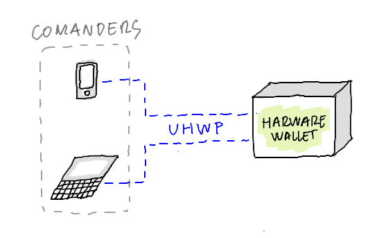

# Universal Hardware Wallet Protocol

> Protocol that standarizes the communication between a hardware wallet device and a comander device.



*Work in progress DRAFT. Consider to donate!*

### Motivation
We have seen the emerging of hardware wallet devices. As every vendor follows their own path, building standard opensource tools that talk to hardware wallets become harder, forcing the ecosystem to follow a propietary approach that becomes a nest for abusive behaviour.

In order to achieve future open hardware wallets, fully opensource standards and tools need to be in place. This project aims to tackle one part of the problem, the standarization of the communication protocol between a hardware wallet and other devices.

### Background
### Requirements
### Definitions

* Account:
* Account balance:
* Commander device:
* Command:
* Command response:
* Hardware wallet:
* Transaction:
* Wallet device:

### Specification index
```
* 1 - Wallet device modes
* 2 - Wallet device states
* 3 - Initialization
  * 3.1 - Master key generation
    * 3.1.1 - BIP39 Master key
    * 3.1.2 - OTP Master key
  * 3.2 - Recovery from Master key
    * 3.2.1 - BIP39 Master key
    * 3.2.2 - OTP Master key
* 4 - New account
* 5 - Export accounts
* 6 - Update balances
* 7 - Sign transaction
* 8 - Export signed transaction
```

### Donations

Do you want to make this possible? Donate to the project

* BTC: `bc1qkt7ujkg7n2ae0t89c0demt5vxxhzfdk5myqdvr`
* ETH: `0x4A9389aa0f782c8754AC3d45Bd53CB6873f14469`
* XMR: `44oSek4fuBfYnur1XogKWqj3BfZGw7BDEf9yUJtE3KpmfjN6e5nUnonCTDkzaSeDktB3MK9GRwAUDPahRmQRLcyE41nAHB4`
* ADA: `addr1qxfa7g7945nhzkt3rcd6c28rafyj8rs48583cpn5xgsh40xfqwqvfh7npd3zzyryu2w84xese57h6cwuzhcpu3fhgxvqszfksz`
